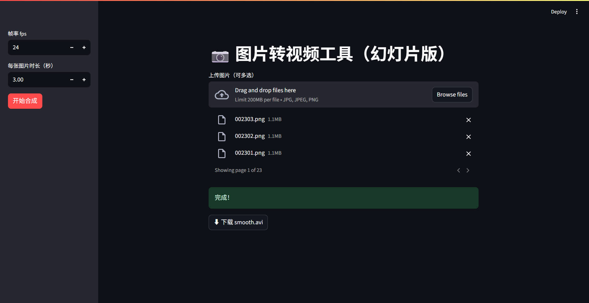
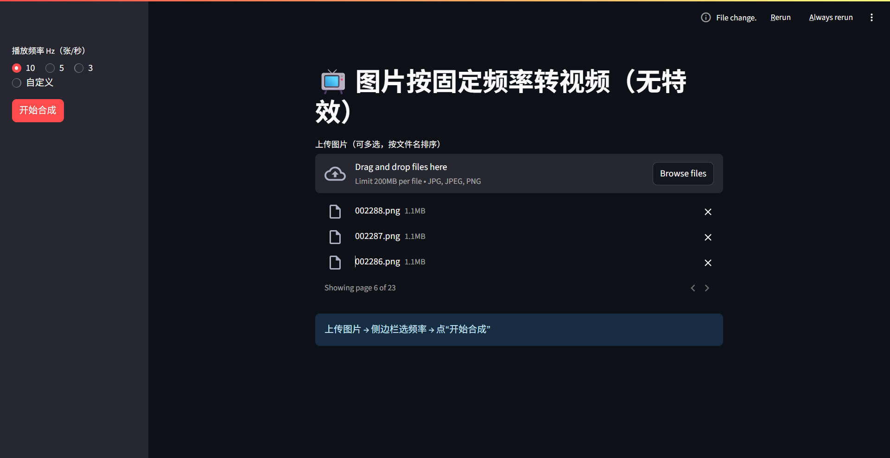

# img2video-web

🎞️ 轻量级 Web 应用 —— 把一堆图片按指定频率（10 Hz / 5 Hz / 3 Hz 或自定义）直接拼成视频，**零特效、零依赖、零命令行**。

> 纯 OpenCV 内核，Streamlit 界面；本地一键跑，浏览器即可用。

img2video_ppt.py


img2video.py


## ⚡ 1 秒上手
```bash
git clone https://github.com/YOUR_NAME/img2video-web.git
cd img2video
pip install streamlit opencv-python natsort
streamlit run img2video.py
```
浏览器自动打开 → 拖图片 → 选频率 → 下载 `avi`。

---

## 🎯 核心功能
| 播放频率 | 每张图时长（30 fps） | 用途示例 |
|----------|----------------------|----------|
| 10 Hz    | 0.1 s                | 快放、延时摄影 |
| 5 Hz     | 0.2 s                | 中等速度 |
| 3 Hz     | 0.33 s               | 慢速展示 |
| 自定义   | 任意                 | 想多慢多快随你 |

---

## 🗂️ 仓库结构
```
img2video-web/
├── hz_img2video.py   # 主程序（<100 行）
├── README.md
├── LICENSE
└── resource/
    └── pic1.jpg      # 网页界面示意图
```

---

## 🚀 部署小贴士
* **本地**：直接 `streamlit run`  
* **服务器**：`streamlit run hz_img2video.py --server.port=8501 --server.address=0.0.0.0`  
* **Docker**：
  ```dockerfile
  FROM python:3.11-slim
  WORKDIR /app
  COPY . .
  RUN pip install streamlit opencv-python natsort
  CMD ["streamlit", "run", "hz_img2video.py", "--server.port=8501", "--server.address=0.0.0.0"]
  ```

---

## 📄 协议
MIT © YOUR_NAME  
欢迎 PR & Star！
```